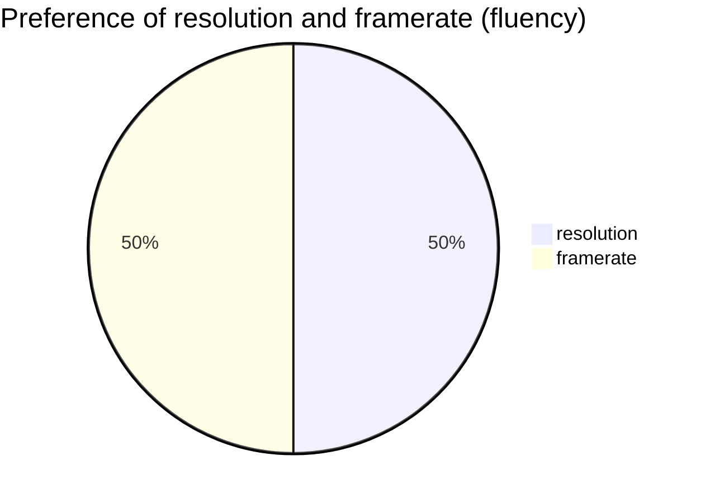
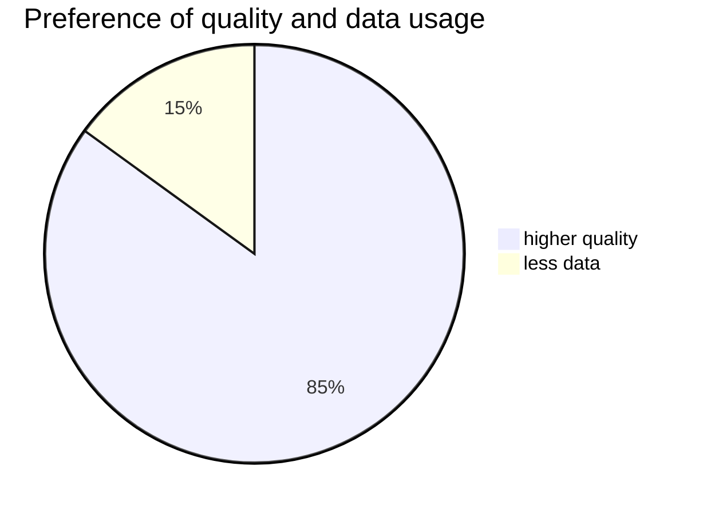

# Which Video Platform Provides the Best Watching Experience?

## Investigating Quality and Cost-Effectiveness of Different Video Platforms

---

## 1. Introduction

In today's digital age, video platforms are a major source of entertainment and information. With the rapid advancement of technology and the widespread use of the internet, numerous video platforms have emerged. With so many options, it can be difficult to determine which platform offers the best watching experience.

Video codecs are essential for modern video platforms. The term 'codec' combines 'encoder' and 'decoder' (Li, 2019). The encoder compresses the video file into a digital format, while the decoder decompresses it for playback. Codecs help reduce file size and enable smooth playback on various devices. Each platform uses different codecs, resulting in differences in video quality. This study investigates how codecs affect video quality and the cost-effectiveness of data usage across different platforms.

By analyzing factors such as video resolution, codec efficiency, and data usage, we recommend which video platform and resolution to choose to economize data usage and achieve the best watching experience from both sensory and economic perspectives.

---

## 2. Methodology

### 2.1 Variable & Data Collection

#### Survey
An online survey was conducted to obtain respondents' subjective feelings while watching videos and to rank the four factors contributing to the evaluation of video platforms. A total of 98 responses were collected.

- People generally prefer to use more data for higher quality video.
- 62% of people choose 1080p as their first choice for resolution, while 35% choose 2160p (4k).

#### Frame Rate: Fluency of Video
- **Unit:** frames per second (fps)
- Frame rate is a controlled variable. Higher frame rates represent greater fluency. We selected 24fps and 60fps to divide the dataset for further evaluation.

#### Video Resolution
- **Unit:** pixels
- Higher resolution means more pixel information and clearer video. We selected 1080p (low) and 4k (high) as the two levels.

#### Bit Rate
- **Unit:** size per second
- Bit rate represents the cost for internet traffic while watching videos. We recorded the bit rate for each platform at specific frame rates and resolutions.

#### Score on Video Impairment
- Video impairment evaluates the quality loss on different platforms. The measurement is based on two key indicators: **PSNR** and **SSIM**.

---

## 3. Prediction

With the popularity of smartphones, the amount of time spent using technology is expected to increase. As technology becomes more accessible, people will likely watch videos more frequently. From a client perspective, we predict that improving video quality will increase viewer satisfaction, but will also require more data usage.

---

## 4. Hypothesis

Cost-effectiveness will decline if increased data usage is required to achieve higher viewer satisfaction, but the improvement in video quality does not match the additional cost.

---

## 5. Assumptions

1. The network environments for each platform are identical; device and internet quality are excluded.
2. **The original file size and resolution** of the video content are the same on each platform to ensure fair comparison.
3. Only user data usage or leasing costs are considered; platform operational costs are ignored.
4. Users have similar preferences for video quality and are willing to sacrifice some quality to save cost.
5. The same video content is available on each platform at a fixed resolution for fair comparison.
6. The same video quality settings are used for each platform.

---

## 6. Measuring Video Quality

### Formula 1

**Score of video:**

$$
Score = \frac{10^{\frac{\alpha}{10}(PSNR\ value)} \times \beta(SSIM\ value) \times \mu(frame\ per\ second)}{\gamma(bit\ rate)}
$$

| Metric                | Unit   | Range |
|-----------------------|--------|-------|
| PSNR                  | dB     | 0-50  |
| SSIM                  | N/A    | 0-1   |
| Frame per second (FPS)| N/A    | N/A   |
| Bitrate               | Kbps   | N/A   |

phothere

#### PSNR (Peak Signal-to-Noise Ratio)

$$PSNR = 10 \log_{10}\left( \frac{2^{\alpha} - 1}{MSE(mean\ square\ error)} \right)$$

- $\alpha$ is a constant referring to color depth (8 bits per sample, $\alpha = 8$).
- If no noise exists, $\alpha = 8$, $MSE = 0$, standard PSNR $\approx 50$.

PSNR measures how well a signal performs in the presence of noise. It is often stated as a decibel-scaled logarithmic number.

#### SSIM (Structural Similarity Index)

Given two signals $x$ and $y$, the structural similarity is defined as:

SSIM measures how similar two digital images are. It is more consistent with human visual perception than PSNR.

---

## 7. Evaluation of Platform Scores

### Key Findings

**Finding 1:**
The advent of video sharing platforms has revolutionized visual content consumption. Platforms like YouTube and Bilibili now provide videos in high resolutions up to 2160p (4K), setting high standards for video quality. Instagram's video quality varies significantly due to faster encoding presets, resulting in higher standard deviation and less consistent quality.

**Finding 2:**
YouTube's 1080p+ (VP9) format is the most efficient among the four platforms. While YouTube and Bilibili have similar video quality, YouTube is generally more data efficient. WeChat's low-quality 360p output makes it unfair to compare its efficiency.

**Finding 3:**
Higher frame rates generally result in lower video quality. This is observed in both YouTube and Bilibili, but YouTube's use of the modern VP9 codec results in a smaller decrease in quality compared to Bilibili's older H264 codec.

### Formula 2

Final score of each video platform (divided into two parts):

$$
\Psi_1 = (\alpha x) + (\beta z)
$$
$$
\Psi_2 = (\alpha y) + (\beta \mu)
$$

Where $\alpha$ and $\beta$ are preference ratios from the survey.

| Symbol | Description |
|--------|-------------|
| x      | Score for 4k & 24fps |
| y      | Score for 4k & 60fps |
| z      | Score for 1080p & 24fps |
| $\mu$  | Score for 1080p & 60fps |
| $\Psi_1$ | Final score for 1080p video |
| $\Psi_2$ | Final score for 4k video |

#### Calculation Table

| Platform   | 4k_60 | 4k_24 | $\Psi_2$ | 1080_60 | 1080_24 | $\Psi_1$ |
|------------|-------|-------|----------|---------|---------|----------|
| YouTube    | 9.86  | 21.89 | 31.75    | 6.3     | 27.67   | 33.97    |
| Bilibili   | 17.83 | 17.72 | 35.55    | 6.67    | 17.83   | 24.5     |
| Instagram  |  N/A  |  N/A  |   N/A    | 2.57    | 6.59    | 9.16     |
| WeChat     |  N/A  |  N/A  |   N/A    | 0.67    | 1.13    | 1.8      |

---

## 8. Conclusion

Based on the data, the ranking of platforms by video quality at 1080p is:

**YouTube > Bilibili > Instagram > WeChat**

YouTube achieved the highest final score (33.17) among all platforms.

For 2160p (4K) video quality, the ranking is:

**Bilibili > YouTube**

After extensive research, data analysis, and user testing, we found that YouTube offers the best combination of quality and cost-effectiveness, with the highest encoding efficiency and lowest data usage. Bilibili is less cost-effective at 1080p but slightly better at 4K. For example, at 1080p 30fps, YouTube used only half the data of Bilibili for similar quality. WeChat performed poorly, providing extremely low video quality.

**Recommendation:** For the best viewing experience and quality, YouTube is the best choice among the options studied, offering stable and cost-effective results.

---

## 9. Evaluation & Limitations

While conducting this project, we encountered several limitations:

**Limitations:**
1. Limited scope: Not all video platforms were covered due to time and resource constraints.
2. Resolution options: Some platforms do not offer all resolutions (e.g., Instagram and WeChat are fixed), making fair comparison difficult.
3. Subjectivity: Evaluating video platforms is subjective; preferences may differ.
4. User bias: Testing may be biased toward certain demographics.
5. Limited sample size: The number of participants may not be representative.
6. Platform updates: Evaluations may become outdated as platforms change.
7. Platform availability: Some platforms may not be available in all regions.

**Improvements:**
1. Expand the evaluation to cover more platforms.
2. Select platforms that all support a range of resolutions (e.g., Facebook, Vimeo) for fairer comparison. Consider focusing on 1080p, as 4K is less commonly used.
3. Use objective metrics such as video bitrate and load times.
4. Involve a more diverse range of participants.
5. Conduct long-term user testing.
6. Use automated testing to reduce technical bias.
7. Test on multiple devices for consistency.

---

## References

- Akyazi, P., & Ebrahimi, T. (2018). Comparison of Compression Efficiency based on Subjective Quality. Assessments. 2018 Tenth International Conference on Quality of Multimedia Experience (QoMEX).
- Miyamoto, Y., Ohta, M., Yano, M., & Nishitani, T. (1992). A Multimedia System Based on Mpeg Video. Coding Algorithm. 4th IEEE ComSoc Workshop on Multimedia Communications. MULTIMEDIA.
- Li, F. F., & Cox, T. J. (2019). Digital signal processing in audio and acoustical engineering. Taylor & Francis.

---

## Appendix

### Normalized Score of All Test Cases

|                | Youtube_24fps | Youtube_60fps | Bilibili_24fps | Bilibili_60fps | Instagram | WeChat |
|----------------|:-------------:|:-------------:|:--------------:|:--------------:|:---------:|:------:|
|                | vp9_4k | vp9_1080 | avc_1080 | vp9_4k | vp9_1080 | avc_1080 | avc_4k | avc_1080+ | avc_1080 | avc_4k | avc_1080+ | avc_1080 | 24fps | 60fps | 24fps | 60fps |
| **Score**      | 21.89  | 27.67    | 15.54     | 9.86   | 6.30     | 4.85      | 17.72  | 17.83     | 25.38    | 8.05   | 6.67      | 5.97     | 6.59  | 10.29 | 10.28 | 6.12  |
| **Resolution Ratio (1080p = 1)** | 4.00 | 1.00 | 1.00 | 4.00 | 1.00 | 1.00 | 4.00 | 1.00 | 1.00 | 4.00 | 1.00 | 1.00 | 1.00 | 0.25 | 0.11 | 0.11 |
| **Normalized Score** | 87.56 | 27.67 | 15.54 | 39.46 | 6.30 | 4.85 | 70.87 | 17.83 | 25.38 | 32.19 | 6.67 | 5.97 | 6.59 | 2.57 | 1.13 | 0.67 |

---
